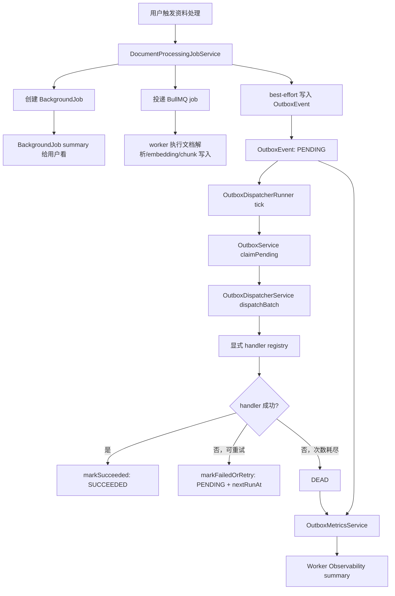

# Durable Outbox 和 Worker Observability：后台任务为什么不能只靠队列

这篇文章复盘 PrepMind AI 的 Phase 7.9。它没有改模型回答效果，也没有新增一个很显眼的前端页面，但它解决的是后台工程里非常关键的问题：

> 用户点了“处理资料”，系统把任务丢进后台之后，怎么保证关键事件不丢？怎么知道有没有积压？怎么处理失败重试？怎么在面试里把 BullMQ、BackgroundJob、EventBus 和 Durable Outbox 的分工讲清楚？

这类问题很适合面试讲，因为它不是“我接了一个队列”这么简单，而是能体现你有没有理解后台任务的可靠性边界。

## 先说结论

Phase 7.9 做的是一条可靠事件闭环：

```text
业务动作发生
  -> 写入 OutboxEvent
  -> worker claim 待处理事件
  -> dispatcher 找到显式 handler
  -> handler 执行成功则标记 SUCCEEDED
  -> 失败则 retry，超过次数进入 DEAD
  -> Worker Observability 暴露只读 summary
```

它不是替代 BullMQ，也不是替代 BackgroundJob，而是补上了一个以前没有的能力：跨进程、跨重启的内部事件事实。

简单分工是：

| 能力                   | 解决什么问题                                                | 不解决什么问题                               |
| ---------------------- | ----------------------------------------------------------- | -------------------------------------------- |
| `BullMQ`               | 执行耗时任务，比如文档解析、embedding、写 chunk             | 不等于用户可见任务状态，也不保存业务事件事实 |
| `BackgroundJob`        | 让当前用户看到任务排队、处理中、成功、失败                  | 不证明 worker 在线，也不是跨进程事件总线     |
| `InProcessEventBus`    | 当前进程内轻量广播，适合低风险观察者                        | 进程重启就丢，不保证跨进程投递               |
| `Durable Outbox`       | 把内部事件可靠落库、claim、重试、dead-letter                | 不直接做耗时业务任务，也不暴露给普通用户操作 |
| `Worker Observability` | 聚合 queue、worker heartbeat、BackgroundJob、outbox summary | 不是完整生产监控平台                         |

## 问题从哪里来

在 Phase 7 之前，PrepMind 已经有知识库后台处理链路：

1. 用户上传资料。
2. API 创建文档处理任务。
3. queue 模式下投递 BullMQ。
4. worker 解析文档、分块、生成 embedding、写入 chunk。
5. 前端通过文档状态和后台任务摘要展示进度。

这已经能解决“接口不要卡死”的问题，但还有一个隐藏缺口。

假设 API 进程做了两件事：

```text
1. 数据库里写入业务状态
2. 发布一个内部事件，告诉系统“资料处理已请求”
```

如果第 1 步成功，第 2 步还没来得及发，进程崩了怎么办？

如果事件只发到内存里的 `EventBus`，那这个事件就丢了。日志里可能没有，worker 也不一定知道，后续观测或补偿动作就断了一截。

这就是 Durable Outbox 要补的洞：先把事件作为数据库事实写下来，再慢慢消费。

## 为什么不能只靠 BullMQ

一个很常见的误解是：既然已经用了 BullMQ，为什么还要 outbox？

因为它们的语义不同。

BullMQ 是任务执行队列，适合做：

- 文档解析
- PDF / DOCX 提取文本
- embedding 调用
- 大批量 chunk 写入
- 失败自动重试

但 outbox 关注的是另一件事：某个业务事件有没有可靠地记录下来，并且有没有被系统内部的 handler 消费。

拿知识库处理举例：

- BullMQ job 说的是：“请执行一次文档处理。”
- BackgroundJob 说的是：“当前用户的这个后台任务现在是什么状态。”
- OutboxEvent 说的是：“系统内部确实发生过一个 `knowledge.document.processing.requested` 事件，并且它可以被可靠消费。”

这三个东西看起来都和后台任务有关，但不要混成一个万能表。混在一起之后，排障时很容易说不清：

- 是队列没消费？
- 是 worker 不在线？
- 是用户任务失败？
- 是内部事件根本没记录？
- 是事件记录了但 handler 一直失败？

Phase 7.9 的价值就在于把这些语义拆开。

## Phase 7.9.1：先把事件落库

第一步不是急着跑起来，而是先建 Durable Outbox 的地基。

我们新增了 `OutboxEvent`，核心状态是：

```text
PENDING -> PROCESSING -> SUCCEEDED
PENDING -> PROCESSING -> PENDING retry
PENDING -> PROCESSING -> DEAD
```

简化后的模型可以理解成这样：

```prisma
model OutboxEvent {
  id             String            @id @default(cuid())
  type           String
  status         OutboxEventStatus @default(PENDING)
  aggregateType  String?
  aggregateId    String?
  idempotencyKey String?           @unique
  payload        Json
  payloadHash    String?
  attempts       Int               @default(0)
  maxAttempts    Int               @default(5)
  nextRunAt      DateTime          @default(now())
  lockedAt       DateTime?
  lockedBy       String?
  lastErrorCode  String?
  lastError      String?           @db.Text
  processedAt    DateTime?
}
```

几个字段很关键：

- `idempotencyKey`：防止同一个业务事件重复写入。
- `attempts / maxAttempts`：控制重试次数。
- `nextRunAt`：失败后延迟到什么时候再跑。
- `lockedBy / lockedAt`：哪个 worker 正在处理，避免并发重复消费。
- `lastErrorCode / lastError`：只保存脱敏错误摘要，不能 dump 完整异常对象。

`OutboxService.enqueue()` 支持幂等写入。重复 `idempotencyKey` 时，不是再插一条，而是返回已有事件：

```ts
async enqueue(input: EnqueueOutboxEventInput) {
  try {
    return await this.prisma.outboxEvent.create({ data: { ... } });
  } catch (error) {
    if (isUniqueConstraintError(error) && input.idempotencyKey) {
      const existing = await this.prisma.outboxEvent.findUnique({
        where: { idempotencyKey: input.idempotencyKey },
      });
      if (existing) return existing;
    }

    throw error;
  }
}
```

这里的幂等非常重要。后台链路最怕“重试一次就多创建一份事实”。幂等键让同一业务动作重复提交时仍然收敛成同一条事件。

## claim 机制怎么避免重复消费

worker 不能随便拿事件。它要 claim：

```ts
const candidates = await this.prisma.outboxEvent.findMany({
  where: claimableWhere,
  orderBy: [{ createdAt: 'asc' }, { id: 'asc' }],
  take: input.limit,
});
```

候选事件包括两类：

- `PENDING` 且 `nextRunAt <= now`：到时间可以执行。
- `PROCESSING` 但 `lockedAt` 太旧：上一个 worker 可能挂了，可以回收。

然后用条件更新抢锁：

```ts
const result = await this.prisma.outboxEvent.updateMany({
  where: {
    id: event.id,
    OR: claimableWhere.OR,
  },
  data: {
    status: 'PROCESSING',
    lockedBy: input.workerId,
    lockedAt: now,
    attempts: { increment: 1 },
  },
});
```

这个写法不是最高吞吐的版本，但足够当前阶段。真正高并发时可以升级 PostgreSQL `FOR UPDATE SKIP LOCKED`。面试里可以直接说明：第一版优先正确性和可测性，后续按吞吐需求升级。

## 失败后怎么重试

事件执行失败时不会马上放弃，而是根据 attempts 做轻量 backoff：

```ts
function retryDelayMs(attempts: number) {
  return Math.min(60_000, 1000 * 2 ** Math.max(0, attempts - 1));
}
```

效果大致是：

- 第 1 次失败：1 秒后重试。
- 第 2 次失败：2 秒后重试。
- 第 3 次失败：4 秒后重试。
- 达到 `maxAttempts`：进入 `DEAD`。

进入 `DEAD` 的含义是：系统已经自动尝试过了，不能再假装一切正常，需要被观测或人工排查。

## Phase 7.9.2：让事件真的被消费

7.9.1 之后，事件已经能落库，但还只是“躺在表里”。7.9.2 增加了 `OutboxDispatcherService`：

```ts
async dispatchBatch(input: DispatchOutboxBatchInput) {
  const events = await this.outboxService.claimPending({
    workerId: input.workerId,
    limit: input.limit ?? 10,
    now,
    lockTimeoutMs: input.lockTimeoutMs,
  });

  let succeeded = 0;
  let failed = 0;
  for (const event of events) {
    try {
      await this.dispatchOne(event);
      await this.outboxService.markSucceeded(event.id, input.workerId);
      succeeded += 1;
    } catch (error) {
      await this.outboxService.markFailedOrRetry({
        id: event.id,
        workerId: input.workerId,
        errorCode: getOutboxErrorCode(error),
        error,
        now,
      });
      failed += 1;
    }
  }

  return { claimed: events.length, succeeded, failed };
}
```

这里有两个设计点很值得讲。

第一，单条失败不影响整批。一个事件 handler 挂了，不应该阻断后面的事件。

第二，handler 必须显式注册。我们没有根据字符串动态执行任意函数，而是维护一个 registry：

```ts
export const outboxHandlers: Record<string, OutboxEventHandler> = {
  'knowledge.document.processing.requested': handleKnowledgeDocumentProcessingRequested,
};
```

这能避免非常危险的设计：把 payload 里的某个字段当成函数名去动态调用。后台事件系统一定要可控、可审计。

## 第一版 handler 为什么只做校验

7.9.2 只接了一个低风险真实事件：

```text
knowledge.document.processing.requested
```

它的 handler 第一版只校验 payload：

```ts
assertString(payload.userId, 'userId');
assertString(payload.documentId, 'documentId');
assertString(payload.backgroundJobId, 'backgroundJobId');
if (typeof payload.force !== 'boolean') {
  throw new OutboxHandlerError(
    'OUTBOX_INVALID_PAYLOAD',
    'Outbox event payload force must be boolean',
  );
}
```

它不重投 BullMQ、不改 `Document`、不改 `BackgroundJob`、不写用户数据。

这不是“没做完”，而是刻意控制风险。因为本阶段目标是验证 outbox 的可靠消费闭环，而不是顺手重构整条文档处理链路。

面试可以这么讲：

> 我先选了一个观测型事件作为低风险接入点。handler 只校验安全 metadata，不改变业务事实来源。这样既能验证 outbox 的 claim、dispatch、retry、dead-letter，又不会把文档处理主链路一次性改复杂。

## Phase 7.9.3：让 worker 自动跑 dispatcher

7.9.2 的 dispatcher 还是“可调用服务”，没有自动运行。7.9.3 新增 `OutboxDispatcherRunnerService`，在 worker 进程中定时 tick。

它的启动条件很保守：

```text
SERVER_ROLE=worker | both
OUTBOX_DISPATCHER_ENABLED=true
```

并且：

- 非 production 默认开启，方便本地开发。
- production 默认关闭，避免部署后未经确认就消费历史事件。
- `api` 角色不运行 outbox dispatcher。

核心逻辑是：

```ts
onModuleInit() {
  if (!this.shouldRun()) return;

  void this.tick();
  this.timer = setInterval(() => {
    void this.tick();
  }, this.intervalMs);
}

private shouldRun() {
  return this.enabled && this.role !== 'api';
}
```

这里有一个很小但很重要的防线：防重入。

```ts
private async tick() {
  if (this.running) {
    this.logger.debug(
      'Outbox dispatcher tick skipped because a previous tick is still running',
    );
    return;
  }

  this.running = true;
  try {
    await this.dispatcher.dispatchBatch({ ... });
  } finally {
    this.running = false;
  }
}
```

如果某一轮 dispatch 还没结束，下一轮 tick 直接跳过。否则一个慢 handler 可能让同一个进程里叠出多轮 dispatcher，排查起来会很痛。

## 为什么不用 BullMQ repeatable job 来跑 outbox

这个问题也很适合面试。

我们没有在第一版用 BullMQ repeatable job 调度 outbox，因为 outbox 本身就是为了解决“内部事件可靠投递”的基础设施。如果 outbox 的消费调度又强绑定到 BullMQ，就会让两个基础设施耦合得太早。

当前 runner 是一个轻量 Nest lifecycle 服务：

- 改动小。
- 测试简单。
- 和 `SERVER_ROLE=api | worker | both` 边界一致。
- 后续真要接生产调度、容器 readiness、Prometheus metrics，也有明确演进方向。

这不是说 BullMQ repeatable job 不好，而是当前阶段不需要把问题复杂化。

## Phase 7.9.4：能跑还不够，还要看得见

7.9.3 后，outbox 已经能自动消费。接下来要解决的是“可观测”。

我们新增了 `OutboxMetricsService`，读取系统级 outbox summary：

```ts
return {
  counts,
  hasBacklog: counts.pending + counts.processing > 0,
  oldestPendingAgeMs: oldestPending
    ? Math.max(0, now.getTime() - oldestPending.createdAt.getTime())
    : null,
  recentErrors: recentErrors.map((event) => ({
    id: event.id,
    type: event.type,
    status: toRecentErrorStatus(event.status),
    lastErrorCode: event.lastErrorCode,
    attempts: event.attempts,
    maxAttempts: event.maxAttempts,
    updatedAt: event.updatedAt.toISOString(),
  })),
};
```

它返回：

- 每个状态的数量：`PENDING / PROCESSING / SUCCEEDED / FAILED / DEAD`
- 是否有 backlog。
- 最老 pending 事件年龄。
- 最近错误摘要。

但它刻意不返回：

- `payload`
- 完整 `lastError`
- `aggregateId`
- prompt
- chunk
- API key
- token / cookie
- 用户私有正文

这个边界非常重要。可观测不是把所有上下文都暴露出来。尤其 outbox 是系统级基础设施信号，不是当前用户私有任务详情。

## 为什么接入 Worker Observability，而不是新开 outbox API

7.9.4 没有新增 `/outbox` API，也没有新增前端 outbox 页面，而是把 summary 接到了现有：

```http
GET /worker-observability/summary
```

原因是：

- Outbox summary 是后台基础设施观测信号。
- Worker Observability 已经承载 queue counts、worker heartbeat、BackgroundJob summary。
- 现有接口已经有 `JwtAuthGuard` 和 `WORKER_OBSERVABILITY_ENABLED` 开关。
- production 默认关闭，避免系统级拓扑和负载信号长期暴露给普通用户。

最终 Worker Observability 现在聚合四类信号：

```text
BullMQ queue counts
Redis worker heartbeat
当前用户 BackgroundJob summary
系统级 Outbox summary
```

其中 `DEAD` outbox event 会让状态进入 `degraded`：

```ts
if (input.hasDeadOutboxEvents) return 'degraded';
if (input.queueBacklogWithoutWorker) return 'attention';
if (input.queuePaused) return 'degraded';
if (input.hasRecentFailures) return 'degraded';
```

这个优先级是一次 review 后补强的点：如果同时存在“队列积压且 worker 无心跳”和“outbox 已经有 DEAD 事件”，不能只显示 `attention`。`DEAD` 代表自动重试已经耗尽，应该优先进入 `degraded`。

而 pending / processing backlog 不直接等于 degraded，因为它可能只是正常处理中。但它会作为独立 signal 返回，方便后续 UI 或 Prometheus 指标使用。

## 一张图讲完整链路



这张图里最重要的是：每个模块都有自己的事实来源，不互相冒充。

## 安全边界怎么设计

后台任务和 outbox 很容易变成“什么都往里面塞”的垃圾桶，这是要避免的。

本项目里明确了几条线：

1. `OutboxEvent.payload` 只能保存安全 metadata。
2. `lastError` 必须脱敏，不保存完整异常对象。
3. summary 不返回 payload、完整错误、业务正文或密钥。
4. production 下 worker observability 默认关闭。
5. outbox handler 必须显式注册，不做字符串动态执行。
6. outbox 写入失败不阻断原有用户请求和 BullMQ 主链路。

尤其第 6 点：这次 requested outbox event 是 best-effort 接入。它增强观测和可靠事件地基，但不应该让用户的资料处理主链路因为 outbox 写入失败而直接失败。

## 这次为什么不需要真实模型验收

Phase 7.9 没有改：

- `/api/chat`
- RAG prompt
- TutorAgent 输出策略
- KnowledgeVerifierAgent guidance
- live / mock 模型切换
- 最终模型回答内容

所以它不需要 live 模型 smoke。它应该用后端单测、类型检查、lint、build 和局部集成测试验收。

这点在面试里也能体现测试分层意识：

- 改 Chat prompt / RAG citation / 最终回答体验：需要 live 小样本。
- 改 embedding 检索质量：需要真实 embedding smoke。
- 改后台任务、outbox、worker observability：重点跑工程链路测试，不要用 live 模型掩盖后端问题。

## 面试可以怎么讲

如果面试官问“你们后台任务怎么做可靠性”，可以这样回答：

> 我们一开始有 BullMQ 负责耗时任务，BackgroundJob 负责用户可见任务状态，EventBus 负责进程内轻量通知。但 EventBus 不持久，进程重启会丢事件，所以后续补了 Durable Outbox。业务事件先写入 PostgreSQL 的 OutboxEvent，再由 worker 进程中的 dispatcher claim、执行 handler、成功标记或失败重试，超过最大次数进入 DEAD。这样事件事实不会因为进程生命周期丢失。

如果问“BullMQ 和 Outbox 有什么区别”，可以这样说：

> BullMQ 是任务执行队列，关注某个耗时 job 怎么跑；Outbox 是可靠事件表，关注某个内部事件是否被记录、是否被消费、失败后是否能重试。BackgroundJob 又是用户视角的任务状态。三者语义不同，所以我没有把它们混成一张表。

如果问“怎么避免 outbox 泄露敏感信息”，可以这样说：

> Outbox payload 只允许安全 metadata，不保存文件内容、prompt、RAG chunk、API key、token 或模型回答。错误只保存脱敏摘要。Worker Observability 里的 outbox summary 只返回状态计数、最近错误码、attempts 和时间，不返回 payload、完整 lastError、aggregateId 或用户内容。production 下观测接口默认关闭。

如果问“怎么处理重复消费”，可以这样说：

> 写入侧用 `idempotencyKey` 防止重复事件；消费侧 claim 时用 `lockedBy / lockedAt` 抢锁，并且只有持有锁的 worker 才能 mark succeeded 或 retry。卡在 PROCESSING 太久的事件会根据 lock timeout 被回收。单进程 runner 还加了 running flag，避免 interval 重入。

如果问“下一步怎么生产化”，可以这样说：

> 现在这版是可靠事件地基和轻量观测。下一步可以逐步把 succeeded / failed / stale skipped 等更多后台事件写入 outbox，再把 outbox summary 转成 Prometheus metrics，按部署形态补容器 readiness、告警规则和 admin-only 修复能力，比如 dead-letter 重放。但第一版先不开放 outbox admin API，避免误操作。

## 这轮开发刻意规避的坑

### 1. 不要把 in-process EventBus 说成可靠消息系统

EventBus 很轻，用起来舒服，但它只在当前进程内有效。它可以做低风险通知和观察者隔离，但不能承诺跨进程可靠投递。

### 2. outbox handler 不能动态执行

事件类型必须映射到显式 handler registry。不要让 payload 决定执行哪个函数，更不要让模型输出决定后端执行路径。

### 3. summary 不能为了方便排查就返回完整 payload

排查方便和数据安全经常冲突。Phase 7.9.4 选择只返回安全摘要，把完整 payload 留在服务内部，而且 payload 本身也必须脱敏。

### 4. backlog 不一定是故障

`PENDING / PROCESSING` 可能只是正常积压，不应该直接打成 `degraded`。但 `DEAD` 代表自动处理已经放弃，需要进入 degraded。

### 5. production 默认开关要保守

Outbox runner 在 production 默认关闭，Worker Observability 在 production 也默认关闭。后台基础设施能力不是越自动越好，生产环境必须显式确认。

## 这一阶段真正的价值

Phase 7.9 的价值不是多了一张表，而是让后台任务链路从“能跑”走向“可解释、可恢复、可观测”。

它补上的能力包括：

- 事件事实可靠落库。
- 幂等写入，避免重复事件污染。
- worker claim 和锁超时回收。
- 失败重试和 dead-letter。
- 显式 handler registry。
- worker-only 自动 dispatcher runner。
- 系统级 outbox summary。
- 和 Worker Observability 的健康信号合并。
- 清晰的隐私和安全边界。

这就是工程化阶段最重要的事情：不要只证明 happy path 能跑，还要证明失败时系统知道自己坏在哪里，并且不会为了排查把敏感信息暴露出去。
